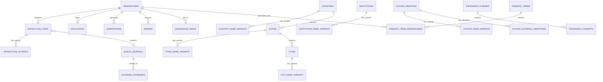

# Arquitetura e Modelagem do Sistema — CECH / UFSCar

Este documento detalha a arquitetura técnica, modelo conceitual, relacionamentos entre entidades, dicionário de campos e decisões de projeto adotadas no Portal de Produção Científica do CECH.

---

## 🏛️ Visão Geral da Arquitetura

O sistema é construído sobre o framework **Symfony 7.2** utilizando a arquitetura clássica MVC com serviços de domínio dedicados, repositórios de consulta otimizados e Doctrine ORM 3.

```
                  ┌─────────────────────────────────┐
                  │          Navegador Web          │
                  │   (Portal Público / Admin)      │
                  └────────────────┬────────────────┘
                                   │ HTTP / SSE
                  ┌────────────────▼────────────────┐
                  │       Controladores (MVC)       │
                  │  App\Controller\pub / admin     │
                  └───────┬─────────────────┬───────┘
                          │                 │
          ┌───────────────▼──────┐   ┌──────▼──────────────┐
          │ Serviços de Domínio  │   │     Repositórios    │
          │ (Backup, Indexing,   │   │  (DQL & Agregações  │
          │ JournalResolver, etc)│   │   Indexadas MySQL)  │
          └───────────────┬──────┘   └──────┬──────────────┘
                          │                 │
                          └────────┬────────┘
                                   │
                  ┌────────────────▼────────────────┐
                  │      Entidades (Doctrine ORM)   │
                  │         100% em Inglês          │
                  └────────────────┬────────────────┘
                                   │
                  ┌────────────────▼────────────────┐
                  │    Banco de Dados MySQL 8.0     │
                  └─────────────────────────────────┘
```

---

## 📊 Diagrama do Modelo de Domínio (ERD)



---

## 🔒 Diretrizes Fixas e Imutáveis

1. **Preservação Total dos Dados Brutos do Lattes**:
   - Campos como `author_name`, `citation_name`, `title`, `journal_name`, `institution_name` recebidos do CNPq/Lattes nunca são alterados ou truncados.
   - Todo enriquecimento é gravado em colunas adicionais (`qualis_journal_id`, `matched_researcher_id`, `author_identity_id`, `indexed_databases`).
2. **Uso Exclusivo de Migrations**:
   - Modificações no esquema de dados são executadas exclusivamente através de migrations versionadas em `migrations/`. O uso de `doctrine:schema:update` é proibido.

---

## 📋 Dicionário de Dados das Entidades

Todas as tabelas, colunas, propriedades, métodos e variáveis foram integralmente padronizadas em **Inglês**.

### 1. `Researcher` (Tabela: `researchers`)
Representa o docente/pesquisador cadastrado a partir de seu currículo Lattes e enriquecido com dados institucionais da UFSCar.

| Campo | Tipo | Descrição |
|---|---|---|
| `id` | INT (PK) | Identificador numérico interno autoincremento. |
| `id_lattes` | VARCHAR(20) | Identificador de 16 dígitos da Plataforma Lattes (ex: `1012351287140134`). |
| `full_name` | VARCHAR(255) | Nome completo oficial do pesquisador. |
| `citation_names` | VARCHAR(500) | Nomes em citações bibliográficas separados por ponto e vírgula. |
| `slug` | VARCHAR(255) | Slug legível para URL amigável (ex: `carlos-alberto-silva`). |
| `orcid` | VARCHAR(50) | Identificador Open Researcher and Contributor ID (ex: `0000-0002-1825-0097`). |
| `email` | VARCHAR(255) | Endereço de correio eletrônico institucional ou de contato. |
| `department` | VARCHAR(255) | Nome completo do departamento acadêmico no CECH. |
| `department_code` | VARCHAR(50) | Sigla institucional do departamento (`DEn`, `DPsi`, `DFil`, `DCSo`, etc.). |
| `unit` | VARCHAR(255) | Unidade gestora principal (`Centro de Educação e Ciências Humanas - CECH`). |
| `admission_year` | INT | Ano de ingresso/admissão na UFSCar. |
| `leave_year` | INT | Ano de saída/aposentadoria (quando aplicável). |
| `birth_city` | VARCHAR(150) | Cidade natal / local de nascimento. |
| `birth_state` | VARCHAR(100) | Estado / UF de nascimento. |
| `birth_country` | VARCHAR(100) | País de nascimento. |
| `nationality` | VARCHAR(100) | Nacionalidade do pesquisador. |
| `abstract_resume` | LONGTEXT | Texto do resumo biográfico profissional registrado no Lattes. |
| `last_lattes_update` | DATETIME | Data e hora da última atualização do currículo no CNPq. |
| `created_at` | DATETIME | Data de criação do registro no banco local. |
| `updated_at` | DATETIME | Data da última atualização no banco local. |

---

### 2. `ProductionItem` (Tabela: `production_items`)
Armazena qualquer produto científico, tecnológico, artístico ou bibliográfico do pesquisador.

| Campo | Tipo | Descrição |
|---|---|---|
| `id` | INT (PK) | Identificador único autoincremento. |
| `researcher_id` | INT (FK) | Vínculo com a entidade `Researcher`. |
| `item_type` | VARCHAR(50) | Categoria: `ARTIGO`, `LIVRO`, `CAPITULO`, `EVENTO`, `TECNICA`, `SOFTWARE`, `PATENTE`, `OUTRO`. |
| `nature` | VARCHAR(100) | Subclassificação (ex: `COMPLETO`, `RESUMO`, `EXPANDIDO`, `PERIODICO`). |
| `title` | TEXT | Título completo da obra ou trabalho. |
| `year` | INT | Ano de publicação ou conclusão. |
| `doi` | VARCHAR(150) | Digital Object Identifier (ex: `10.1590/0104-4060.71887`). |
| `language` | VARCHAR(50) | Idioma da publicação (ex: `Português`, `Inglês`, `Espanhol`). |
| `country` | VARCHAR(100) | País de publicação do veículo ou realização do evento. |
| `journal_name` | VARCHAR(255) | Nome bruto do periódico registrado no Lattes. |
| `issn` | VARCHAR(20) | Código ISSN do periódico no Lattes. |
| `qualis_journal_id` | INT (FK) | Vínculo resolvido com o periódico canônico (`QualisJournal`). |
| `qualis` | VARCHAR(10) | Estrato CAPES atribuído (`A1`, `A2`, `A3`, `A4`, `B1`, `B2`, `B3`, `B4`, `C`). |
| `indexed_databases` | JSON | Metadados serializados das bases científicas indexadoras do periódico. |
| `publisher` | VARCHAR(255) | Nome da editora comercial ou universitária. |
| `isbn` | VARCHAR(30) | Código ISBN do livro ou coletânea. |
| `event_name` | VARCHAR(255) | Nome do congresso, simpósio ou encontro científico. |
| `event_city` | VARCHAR(150) | Cidade onde o evento científico ocorreu. |

---

### 3. `ProductionAuthor` (Tabela: `production_authors`)
Armazena a autoria detalhada de cada item de produção para possibilitar análises de coautoria e redes de colaboração.

| Campo | Tipo | Descrição |
|---|---|---|
| `id` | INT (PK) | Identificador único autoincremento. |
| `production_item_id` | INT (FK) | Vínculo com a entidade `ProductionItem`. |
| `author_name` | VARCHAR(255) | Nome por extenso do autor. |
| `citation_name` | VARCHAR(255) | Nome no formato de citação bibliográfica (ex: `SILVA, C. A.`). |
| `id_lattes` | VARCHAR(20) | ID Lattes do coautor (se presente no XML). |
| `author_order` | INT | Ordem de aparição na autoria (1 = primeiro autor). |
| `is_cech_researcher` | BOOLEAN | Indica se o coautor é um docente cadastrado no CECH. |
| `matched_researcher_id`| INT (FK) | ID do docente do CECH associado. |
| `author_identity_id` | INT (FK) | ID de autoridade do tesauro (`AuthorIdentity`). |

---

### 4. `QualisJournal` (Tabela: `qualis_journals`) & `AcademicDatabase` (Tabela: `academic_databases`)
- **`QualisJournal`**: Contém os 63.122 periódicos mapeados com seus ISSNs triplos (`issn_e`, `issn_imp`, `issn_l`), estrato Qualis e relacionamentos $N:M$ com bases científicas.
- **`AcademicDatabase`**: Bases científicas internacionais (Scopus, Web of Science, PubMed, Latindex, SciELO, DOAJ, OpenAlex).

---

### 5. `ThematicTerm` (Tabela: `thematic_terms`) & `ThematicTermResearcher` (Tabela: `thematic_term_researchers`)
Estrutura ontológica para busca e descoberta por palavras-chave, conceitos e sintagmas.

| Tabela | Chave Primária | Relacionamentos | Finalidade |
|---|---|---|---|
| `thematic_terms` | `id` | 1:N com `thematic_term_researchers` | Armazena termos canônicos, slug permalink, total de ocorrências e contagem de docentes |
| `thematic_term_researchers` | `id` | N:1 com `thematic_terms`, N:1 com `researchers` | Matriz de ponderação com ocorrências do docente no tema e amostra de títulos representativos (`sample_titles` JSON) |

---

## 🔍 Arquitetura da Pesquisa Temática: `ThematicTermIndexService`

O subsistema de descoberta temática processa de forma integrada o acervo do Currículo Lattes e do Repositório Institucional TeD-UFSCar:
1. **Mineração de Conceitos**: Extração de palavras-chave declaradas e bigramas/sintagmas de títulos com remoção de stop-words acadêmicas.
2. **APIs Otimizadas**:
   - `/api/temas/autocomplete`: Busca em tempo real com debounce, ponderando termos por classes de frequência (`weight`).
   - `/api/temas/docentes`: Paginação sob demanda de 10 em 10 docentes associados ao tema com rankings por departamento.
3. **Deep Linking Bi-direcional**: O clique no card do docente transfere o tema via query string (`?tema={nome}#productions`), aplicando o filtro cienciométrico com normalização de acentos e scroll suave automático.

---

## 📱 Arquitetura de Navegação Mobile Responsiva (*Slide-Over Drawer*)

Para garantir experiência fluida em smartphones e tablets:
1. **Botão Hambúrguer Touch**: Integrado no header em telas `< md` (`#mobile-menu-btn`).
2. **Slide-Over Drawer com Backdrop**: Gaveta lateral deslizante com aceleração cúbica (`duration-300 ease-in-out`), efeito de vidro (`backdrop-blur-xl bg-white/95 dark:bg-slate-950/95`) e travamento de rolagem no `body`.
3. **Barra de Busca Integrada**: Permite pesquisar no acervo diretamente a partir da gaveta em telas estreitas onde a barra do header é oculta.
4. **Atalhos Rápidos**: Pílulas de temas frequentes e alternador ergonômico de tema (Claro / Escuro).

---

## 🚀 Arquitetura de Alta Performance: `JournalResolverService`

Para evitar estouro de memória (`memory_limit` de 128MB) decorrente da serialização de 63.000 periódicos no cache Symfony, o serviço implementa uma **Arquitetura Dual**:

1. **Modo Web On-Demand (Consumo: < 100 KB de RAM)**:
   - Utiliza consultas SQL indexadas no MySQL (`WHERE issn_e = :issn OR issn_imp = :issn OR issn_l = :issn`).
   - Memoização em memória local por requisição.
2. **Modo CLI / Lote Massivo (`loadFullMaps()`)**:
   - Carrega o mapa completo na memória RAM durante a execução de comandos de console (`app:index:journals`).
   - Permite indexar 13.469 artigos em menos de **7 segundos**.

---

## 💾 Arquitetura de Backup & Superdump em Tempo Real

O serviço `DatabaseBackupService` fornece:
- Geração de superdump MySQL com `CREATE TABLE`, `DROP TABLE IF EXISTS`, restrições de chaves e dados completos.
- Streaming em tempo real via **Server-Sent Events (SSE)** informando o progresso tabela por tabela.
- Compressão ZIP integrada gerando arquivos `.sql.zip`.

