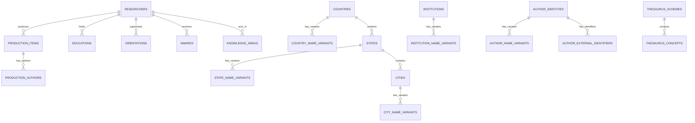

# Arquitetura e Modelagem do Sistema — CECH / UFSCar

Este documento detalha a arquitetura técnica, modelo conceitual, relacionamentos entre entidades, dicionário de campos e decisões de projeto adotadas no Portal de Produção Científica do CECH.

---

## 🏛️ Visão Geral da Arquitetura

O sistema é construído sobre o framework **Symfony 7.2** utilizando a arquitetura clássica MVC com serviços de domínio dedicados, repositórios de consulta otimizados e Doctrine ORM 3.

```
                  ┌─────────────────────────────────┐
                  │          Navegador Web          │
                  │   (Portal Público / Admin)      │
                  └────────────────┬────────────────┘
                                   │ HTTP
                  ┌────────────────▼────────────────┐
                  │       Controladores (MVC)       │
                  │  App\Controller\pub / admin     │
                  └───────┬─────────────────┬───────┘
                          │                 │
          ┌───────────────▼──────┐   ┌──────▼──────────────┐
          │ Serviços de Negócio  │   │     Repositórios    │
          │ (Import/Export/Merge)│   │  (DQL & Agregações) │
          └───────────────┬──────┘   └──────┬──────────────┘
                          │                 │
                          └────────┬────────┘
                                   │
                  ┌────────────────▼────────────────┐
                  │      Entidades (Doctrine ORM)   │
                  │         100% em Inglês          │
                  └────────────────┬────────────────┘
                                   │
                  ┌────────────────▼────────────────┐
                  │    Banco de Dados MySQL 8.0     │
                  └─────────────────────────────────┘
```

---

## 📊 Diagrama do Modelo de Domínio (ERD)



---

## 📋 Dicionário de Dados das Entidades

Todas as tabelas, colunas, propriedades, métodos e variáveis foram integralmente padronizadas em **Inglês** para manter conformidade com boas práticas de engenharia de software e facilidade de manutenção.

### 1. `Researcher` (Tabela: `researchers`)
Representa o docente/pesquisador cadastrado a partir de seu currículo Lattes e enriquecido com dados institucionais da UFSCar.

| Campo | Tipo | Descrição |
|---|---|---|
| `id` | INT (PK) | Identificador numérico interno autoincremento. |
| `id_lattes` | VARCHAR(20) | Identificador de 16 dígitos da Plataforma Lattes do CNPq (ex: `1012351287140134`). |
| `full_name` | VARCHAR(255) | Nome completo oficial do pesquisador. |
| `citation_names` | VARCHAR(500) | Nomes em citações bibliográficas separados por ponto e vírgula. |
| `slug` | VARCHAR(255) | Slug legível para URL amigável (ex: `carlos-alberto-silva`). |
| `orcid` | VARCHAR(50) | Identificador Open Researcher and Contributor ID (ex: `0000-0002-1825-0097`). |
| `email` | VARCHAR(255) | Endereço de correio eletrônico institucional ou de contato. |
| `department` | VARCHAR(255) | Nome completo do departamento acadêmico no CECH (ex: `Departamento de Educação`). |
| `department_code` | VARCHAR(50) | Sigla institucional do departamento (ex: `DEn`, `DPsi`, `DFil`, `DCSo`). |
| `unit` | VARCHAR(255) | Unidade gestora principal (`Centro de Educação e Ciências Humanas - CECH`). |
| `admission_year` | INT | Ano de ingresso/admissão na UFSCar. |
| `leave_year` | INT | Ano de saída/aposentadoria (quando aplicável). |
| `birth_city` | VARCHAR(150) | Cidade natal / local de nascimento. |
| `birth_state` | VARCHAR(100) | Estado / UF de nascimento. |
| `birth_country` | VARCHAR(100) | País de nascimento. |
| `nationality` | VARCHAR(100) | Nacionalidade do pesquisador. |
| `abstract_resume` | LONGTEXT | Texto do resumo biográfico profissional registrado no Lattes. |
| `last_lattes_update` | DATETIME | Data e hora da última atualização do currículo no CNPq. |
| `created_at` | DATETIME | Data de criação do registro no banco local. |
| `updated_at` | DATETIME | Data da última atualização no banco local. |

---

### 2. `ProductionItem` (Tabela: `production_items`)
Armazena qualquer produto científico, tecnológico, artístico ou bibliográfico do pesquisador.

| Campo | Tipo | Descrição |
|---|---|---|
| `id` | INT (PK) | Identificador único autoincremento. |
| `researcher_id` | INT (FK) | Vínculo com a entidade `Researcher`. |
| `item_type` | VARCHAR(50) | Categoria: `ARTIGO`, `LIVRO`, `CAPITULO`, `EVENTO`, `TECNICA`, `SOFTWARE`, `PATENTE`, `OUTRO`. |
| `nature` | VARCHAR(100) | Subclassificação (ex: `COMPLETO`, `RESUMO`, `EXPANDIDO`, `PERIODICO`). |
| `title` | TEXT | Título completo da obra ou trabalho. |
| `year` | INT | Ano de publicação ou conclusão. |
| `doi` | VARCHAR(150) | Digital Object Identifier (ex: `10.1590/0104-4060.71887`). |
| `language` | VARCHAR(50) | Idioma da publicação (ex: `Português`, `Inglês`, `Espanhol`). |
| `country` | VARCHAR(100) | País de publicação do veículo ou realização do evento. |
| `journal_name` | VARCHAR(255) | Nome do periódico científico ou veículo de divulgação. |
| `issn` | VARCHAR(20) | Código ISSN do periódico. |
| `volume` | VARCHAR(50) | Volume da revista/fascículo. |
| `issue` | VARCHAR(50) | Número/fascículo da revista. |
| `pages` | VARCHAR(100) | Intervalo de páginas (ex: `120-135`). |
| `qualis` | VARCHAR(10) | Estrato CAPES atribuído (ex: `A1`, `A2`, `A3`, `A4`, `B1`, `B2`, `B3`, `B4`, `C`). |
| `publisher` | VARCHAR(255) | Nome da editora comercial ou universitária. |
| `isbn` | VARCHAR(30) | Código ISBN do livro ou coletânea. |
| `event_name` | VARCHAR(255) | Nome do congresso, simpósio ou encontro científico. |
| `event_city` | VARCHAR(150) | Cidade onde o evento científico ocorreu. |

#### 🔗 Método Especial: `getDoiUrl()`
Gera automaticamente a URL canônica https para abertura do DOI em nova aba com segurança:
```php
public function getDoiUrl(): ?string
{
    if (empty($this->doi)) return null;
    $clean = trim($this->doi);
    if (str_starts_with($clean, 'http://') || str_starts_with($clean, 'https://')) {
        return $clean;
    }
    return 'https://doi.org/' . ltrim($clean, '/');
}
```

---

### 3. `ProductionAuthor` (Tabela: `production_authors`)
Armazena a autoria detalhada de cada item de produção para possibilitar análises de coautoria e redes de colaboração.

| Campo | Tipo | Descrição |
|---|---|---|
| `id` | INT (PK) | Identificador único autoincremento. |
| `production_item_id` | INT (FK) | Vínculo com a entidade `ProductionItem`. |
| `author_name` | VARCHAR(255) | Nome por extenso do autor. |
| `citation_name` | VARCHAR(255) | Nome no formato de citação bibliográfica (ex: `SILVA, C. A.`). |
| `id_lattes` | VARCHAR(20) | ID Lattes do coautor (se presente no XML). |
| `author_order` | INT | Ordem de aparição na autoria (1 = primeiro autor). |

---

### 4. `Education` (Tabela: `educations`)
Graus acadêmicos e cursos concluídos pelo pesquisador.

| Campo | Tipo | Descrição |
|---|---|---|
| `id` | INT (PK) | Identificador único autoincremento. |
| `researcher_id` | INT (FK) | Vínculo com a entidade `Researcher`. |
| `level` | VARCHAR(50) | Nível de formação: `GRADUACAO`, `ESPECIALIZACAO`, `MESTRADO`, `DOUTORADO`, `POS-DOUTORADO`. |
| `course_name` | VARCHAR(255) | Nome do curso / programa de pós-graduação. |
| `institution_name` | VARCHAR(255) | Nome da universidade ou faculdade formadora. |
| `start_year` | INT | Ano de início. |
| `end_year` | INT | Ano de conclusão / obtenção do título. |
| `monograph_title` | TEXT | Título do trabalho de conclusão, dissertação ou tese. |
| `advisor_name` | VARCHAR(255) | Nome do orientador ou supervisor acadêmico. |

---

### 5. `Orientation` (Tabela: `orientations`)
Trabalhos de orientação acadêmica concluídos ou em andamento.

| Campo | Tipo | Descrição |
|---|---|---|
| `id` | INT (PK) | Identificador único autoincremento. |
| `researcher_id` | INT (FK) | Vínculo com a entidade `Researcher`. |
| `orientation_type` | VARCHAR(100) | Tipo: `Dissertação de mestrado`, `Tese de doutorado`, `Iniciação Científica`, `TCC`. |
| `nature` | VARCHAR(50) | Situação: `Concluída` ou `Em Andamento`. |
| `student_name` | VARCHAR(255) | Nome do estudante orientando. |
| `title` | TEXT | Título do projeto de pesquisa ou trabalho. |
| `year` | INT | Ano de conclusão ou ano de início. |
| `institution_name` | VARCHAR(255) | Nome da instituição de ensino superior. |
| `course_name` | VARCHAR(255) | Nome do curso ou programa de pós-graduação. |

---

### 6. `Award` (Tabela: `awards`) e `KnowledgeArea` (Tabela: `knowledge_areas`)
- **`Award`**: Títulos honoríficos, prêmios recebidos e distinções acadêmicas.
- **`KnowledgeArea`**: Grande área, área, subárea e especialidade do conhecimento registradas pelo pesquisador perante o CNPq.

---

### 7. Vocabulários Controlados e Tesauros (BiblioMap)
- **`Country` (`countries`)** & **`CountryVariation` (`country_name_variants`)**: Países padronizados e suas centenas de sinônimos/traduções.
- **`State` (`states`)** & **`StateVariation` (`state_name_variants`)**: Estados federados.
- **`City` (`cities`)** & **`CityVariation` (`city_name_variants`)**: Cidades e coordenadas geográficas.
- **`Institution` (`institutions`)** & **`InstitutionVariation` (`institution_name_variants`)**: Instituições de ensino superior e centros de pesquisa.
- **`AuthorIdentity` (`author_identities`)**, **`AuthorNameVariant` (`author_name_variants`)** e **`AuthorExternalIdentifier` (`author_external_identifiers`)**: Autoridades de nomes de autores para desambiguação e resolução de sinônimos bibliográficos.
