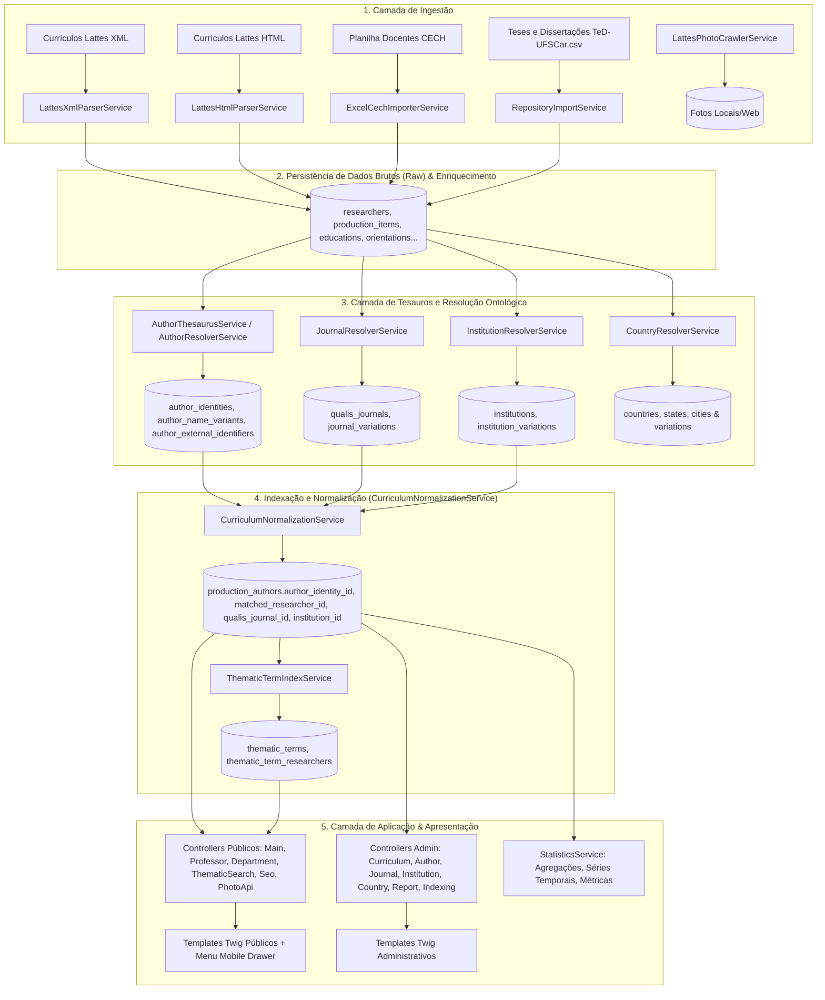

# Arquitetura e Processos do Sistema — CECH UFSCar

Este documento descreve detalhadamente a arquitetura, o fluxo de dados, os subsistemas e todos os processos de negócio da plataforma **CECH UFSCar** (Centro de Educação e Ciências Humanas).

---

## 1. Visão Geral da Arquitetura

A plataforma foi desenvolvida sobre o framework **Symfony 7 (PHP 8.2+)**, utilizando **Doctrine ORM**, **Twig**, **Tailwind CSS**, **Shoelace Web Components** e **Stimulus**.

A principal finalidade do sistema é:
1. **Ingerir e extrair** currículos Lattes de docentes e pesquisadores (em XML, HTML e planilhas institucionais).
2. **Preservar estritamente** os dados brutos recebidos da plataforma Lattes (nunca alterar colunas originais).
3. **Tratar e desambiguar ontologias** através de Tesauros especializados (Autores/Coautores, Periódicos/Qualis, Instituições e Países/Cidades).
4. **Normalizar e indexar** produções científicas, projetos, orientações e colaborações em colunas dedicadas de busca e coautoria.
5. **Calcular estatísticas** e agregar indicadores de produção e cooperação acadêmica.
6. **Apresentar os dados** em portais públicos (páginas de docentes, departamentos, busca com filtros facetados, gráficos) e permitir **curadoria administrativa** no painel de controle.

---

## 2. Detalhamento dos Processos do Sistema

### Processo 1: Ingestão de Dados do Currículo Lattes e Repositório

#### 1.1 Ingestão XML (`LattesXmlParserService` & `ImportLattesCommand`)
- **Comando CLI**: `php bin/console app:import:lattes [--dir=docs/banco/CECH] [--file=caminho/arquivo.xml]`
- **Entrada**: Arquivo XML padronizado do CNPq (`CURRICULO-VITAE`).
- **Etapas**:
  1. Leitura do atributo `NUMERO-IDENTIFICADOR` (ID Lattes de 16 dígitos).
  2. Localização ou criação da entidade `Researcher` correspondente.
  3. Extração dos dados gerais (`DADOS-GERAIS`): Nome Completo, Nomes em Citações Bibliográficas, Resumo, Endereço de Atuação, Nacionalidade e Local de Nascimento.
  4. Extração de Formação Acadêmica (`FORMACAO-ACADEMICA-TITULACAO`): Graduação, Especialização, Mestrado, Doutorado, Pós-Doutorado e Livre-Docência (`Education`).
  5. Extração de Atuação Profissional (`ATUACOES-PROFISSIONAIS`): Vínculos institucionais e projetos de pesquisa (`ProfessionalExperience`, `ResearchProject`).
  6. Extração de Produções Bibliográficas, Técnicas e Artísticas (`PRODUCAO-BIBLIOGRAFICA`, `PRODUCAO-TECNICA`, `OUTRA-PRODUCAO`):
     - Artigos em periódicos (`TYPE_ARTIGO`)
     - Livros publicados/organizados (`TYPE_LIVRO`)
     - Capítulos de livros (`TYPE_CAPITULO`)
     - Textos em jornais/revistas (`TYPE_TEXTO_JORNAL`)
     - Trabalhos em eventos/anais (`TYPE_EVENTO`)
     - Softwares e Aplicativos (`TYPE_SOFTWARE`)
     - Patentes e Marcas (`TYPE_PATENTE`, `TYPE_MARCA`)
     - Trabalhos técnicos e relatórios (`TYPE_TRABALHO_TECNICO`)
     - Produções artísticas/culturais (`TYPE_ARTISTICA`)
  7. Extração de Coautores de cada produção (`ProductionAuthor`): Ordem de autoria, nome original como veio no Lattes e variações de citação.
  8. Extração de Orientações Concluídas e em Andamento (`DADOS-COMPLEMENTARES` / `ORIENTACOES-CONCLUIDAS` / `ORIENTACOES-EM-ANDAMENTO`): Aluno, título, instituição, ano, agência de fomento (`Orientation`).
  9. Extração de Bancas Julgadoras (`PARTICIPACAO-EM-BANCA-TRABALHOS-CONCLUSAO`, etc.) e Prêmios/Títulos (`Award`).
  10. Extração de Áreas de Conhecimento (`KnowledgeArea`) e Idiomas (`LanguageProficiency`).
  11. Execução do pipeline de sincronização com o Tesauro de Autores e Normalização de Coautorias.

#### 1.2 Ingestão HTML (`LattesHtmlParserService`)
- **Finalidade**: Fallback e suporte para páginas salvas em formato HTML público do Lattes.
- **Técnica**: Utiliza `DOMDocument` e `DOMXPath` para varrer tabelas e classes CSS clássicas da plataforma Lattes.

#### 1.3 Ingestão Planilha Docentes CECH (`ExcelCechImporterService` & `ImportExcelCechCommand`)
- **Comando CLI**: `php bin/console app:import:excel-cech [caminho_planilha.xlsx]`
- **Finalidade**: Cruzar a relação oficial de docentes com departamento, código departamental, e-mail institucional e status de admissão/afastamento.

#### 1.4 Ingestão de Teses e Dissertações do Repositório Institucional (`RepositoryImportService` & `ImportRepositoryCommand`)
- **Comando CLI**: `php bin/console app:import:repository` (alias `app:import:ted`)
- **Entrada**: Arquivo CSV do Repositório DSpace/BDTD da UFSCar (`docs/banco/TeD-UFSCar.csv`).
- **Finalidade e Regras**:
  1. Cruzamento em cascata para identificar orientadores e coorientadores docentes cadastrados no CECH (via ID Lattes de 16 dígitos, ORCID ou nome normalizado).
  2. **Enriquecimento sem duplicação**: Quando o trabalho já existe como orientação vinda do Lattes (mesmo aluno + tipo + ano/título), enriquece o registro existente com o link persistente (`Handle`), resumo acadêmico, programa de pós-graduação e data de defesa.
  3. **Novas obras inéditas**: Quando o trabalho existe no repositório institucional mas não foi informado no Lattes pelo docente, cadastra uma nova `Orientation` concluída (`source = 'repository_ufscar'`).
  4. **Idempotência**: Verifica `handle` e `repository_uuid` para garantir que reexecuções ou novos dumps atualizem dados sem duplicar registros.
- **Documentação Completa**: Consulte [`docs/REPOSITORY_IMPORT.md`](file:///Users/jonaspoli/work/html/ufscar-cech/docs/REPOSITORY_IMPORT.md).

#### 1.5 Coleta Automatizada de Fotos (`LattesPhotoCrawlerService` & `CrawlLattesPhotosCommand`)
- **Comando CLI**: `php bin/console app:crawl:lattes-photos`
- **Finalidade**: Fazer download das fotos de perfil dos pesquisadores diretamente dos servidores de mídia do CNPq a partir do ID Lattes e salvar localmente em `public/uploads/photos/` com rota otimizada em `PhotoApiController`.

---

### Processo 2: Subsistema de Tesauros e Resolução Ontológica

#### 2.1 Tesauro de Autores (`AuthorThesaurusService` & `AuthorResolverService`)
- **Tabelas do Banco de Dados**:
  - `author_identities`: Identidade canônica do autor/pesquisador (nome preferencial, nome normalizado, status).
  - `author_name_variants`: Todas as variações textuais associadas àquela identidade (ex: `SILVA, J. A.`, `SILVA, Jose Antonio`, `DA SILVA, J. A.`).
  - `author_external_identifiers`: Identificadores externos (ORCID, Lattes ID, Scopus Author ID, ResearcherID).
- **Processamento de Resolução**:
  1. Ao importar ou normalizar um currículo, o nome do docente e todas as suas citações bibliográficas são registrados em `author_identities` e `author_name_variants`.
  2. O `AuthorResolverService` constrói um índice otimizado em memória e em cache Symfony (`thesaurus_author_index_v2`).
  3. Durante a análise das produções, cada coautor (`ProductionAuthor`) tem seu nome normalizado (`StringNormalizer::normalizeString`) e comparado contra o índice.
  4. Caso o coautor corresponda a um docente cadastrado no CECH, a coluna `matched_researcher_id` e o `author_identity_id` são preenchidos, permitindo calcular coautorias e colaborações institucionais.
  5. Se o coautor pertencer ao próprio currículo do pesquisador em questão, a flag `is_self` é definida como `true`.

#### 2.2 Tesauro de Periódicos e Qualis CAPES (`JournalResolverService` & `QualisJournal`)
- **Tabelas do Banco de Dados**:
  - `qualis_journals`: Lista mestre de periódicos científicos com ISSN, nome oficial, área de avaliação e estrato Qualis CAPES (A1 a C).
  - `journal_variations`: Nomes alternativos, abreviaturas e grafias incorretas associadas ao periódico canônico.
- **Processamento de Resolução**:
  1. Normalização do ISSN (remoção de traços, espaços e caracteres inválidos).
  2. Busca exata por ISSN na tabela `qualis_journals`.
  3. Caso o ISSN não esteja disponível ou não encontre, busca pelo nome do periódico normalizado em `journal_variations` e `qualis_journals`.
  4. O `production_items.qualis_journal_id` e o estrato `qualis` da produção são atualizados.

#### 2.3 Tesauro Institucional (`InstitutionResolverService` & `Institution`)
- **Tabelas do Banco de Dados**:
  - `institutions`: Instituição canônica (ex: `Universidade Federal de São Carlos`, sigla `UFSCar`, país, estado).
  - `institution_variations`: Variações textuais e siglas registradas no Lattes (ex: `U. F. São Carlos`, `Univ Federal de Sao Carlos`, `UFSCAR`).
- **Processamento de Resolução**:
  - Mapeia as instituições de formação (`Education`), atuação profissional (`ProfessionalExperience`) e orientação (`Orientation`) para a entidade canônica.

#### 2.4 Tesauro Geográfico (`CountryResolverService`, `Country`, `State`, `City`)
- **Tabelas do Banco de Dados**:
  - `countries`, `country_variations`: Países atuais e históricos (ex: `URSS`, `Alemanha Ocidental`, `Iugoslávia`) mapeados para códigos ISO e nomes padronizados em português.
  - `states`, `state_variations`: Unidades Federativas do Brasil e estados/províncias estrangeiras.
  - `cities`, `city_variations`: Cidades e variações de grafia.

---

### Processo 3: Indexação e Normalização (`CurriculumNormalizationService`)

- **Comando CLI**: `php bin/console app:curriculums:normalize [--id=ID_LATTES] [--all]`
- **Regra Central**:
  - O sistema itera sobre todos os pesquisadores e suas respectivas produções científicas.
  - Para cada produção:
    1. Resolve o periódico e atribui o melhor estrato Qualis (`qualis_journal_id`, `qualis`).
    2. Resolve a lista de coautores (`ProductionAuthor`), associando `author_identity_id`, `matched_researcher_id` e `is_self`.
    3. Resolve instituições de formações e atuações profissionais.
    4. Define `is_indexed = 1` e atualiza carimbo de data da indexação.

---

### Processo 4: Motor de Estatísticas e Indicadores (`StatisticsService`)

O `StatisticsService` é responsável por consolidar dados analíticos em tempo de execução ou via cache:
1. **Totais Gerais**: Total de pesquisadores, produções totais, produções com DOI, livros, capítulos, artigos A1-A4, orientações concluídas e ativas.
2. **Séries Temporais**: Evolução anual de produções bibliográficas nos últimos 10 a 20 anos.
3. **Distribuição Qualis**: Proporção de artigos por estrato (A1, A2, A3, A4, B1, B2, B3, B4, C).
4. **Métricas Departamentais**: Comparações agregadas de produtividade e orientações por departamento acadêmico (ex: Departamento de Educação, Departamento de Ciências Sociais, Departamento de Filosofia, etc.).
5. **Grafo de Coautoria**: Contagem de artigos publicados em coautoria entre docentes do próprio CECH.

---

### Processo 5: Portais de Visualização e Apresentação (Twig & Controllers)

#### 5.1 Portal Público (`templates/pub/`)
- **Menu Mobile Responsivo (`#mobile-menu-drawer`)**:
  - Drawer deslizante lateral com efeito vidro (`backdrop-blur-xl bg-white/95 dark:bg-slate-950/95`).
  - Campo de busca integrado ao drawer em telas compactas.
  - Navegação rica com ícones temáticos, legendas e badges (*Auto-Avaliação*, *Descoberta*).
  - Atalhos diretos para temas em destaque e seletor tátil de tema (Claro / Escuro).
  - Acessibilidade completa com tecla ESC e bloqueio de rolagem de fundo.
- **Página Inicial (`templates/pub/main/home.html.twig`)**: Apresentação institucional, busca rápida por docentes, estatísticas resumidas e destaques.
- **Pesquisa Temática por Palavras-Chave (`/temas`)**:
  - Catálogo de dezenas de milhares de conceitos indexados de Lattes e Repositório UFSCar.
  - Autocomplete em tempo real com debounce (`/api/temas/autocomplete`).
  - Nuvem de tags ponderada por classes de frequência (roxo, azul forte, azul suave e cinza).
  - Painel de detalhes com total de ocorrências, quantidade de docentes e distribuição por departamento acadêmico.
  - Grade de docentes associados com paginação assíncrona de 10 em 10 (`/api/temas/docentes`).
  - Transição integrada para o perfil docente já filtrado na aba de produções.
- **Página de Pesquisa Geral (`templates/pub/main/search.html.twig`)**: Filtro facetado por departamento, tipo de produção, palavras-chave e estrato Qualis.
- **Painel de Indicadores (`templates/pub/main/indicadores.html.twig`)**:
  - 18 Figuras Analíticas e Gráficos Interativos (Chart.js) divididos em 4 blocos temáticos:
    1. *Corpo Docente & Vínculos* (Figuras 1 a 7)
    2. *Formação & Orientações* (Figuras 8 a 10)
    3. *Produção Científica & Qualis* (Figuras 11 a 15)
    4. *Redes de Colaboração & Parcerias* (Figuras 16 a 18)
- **Listagem e Detalhe de Departamentos (`templates/pub/department/`)**: Docentes vinculados ao departamento, produção consolidada e contatos.
- **Perfil Completo do Pesquisador (`templates/pub/professor/show.html.twig`)**:
  - Dados biográficos, foto oficial, IDs externos (ORCID, Lattes).
  - **Nuvem de Tags no Topo da Produção**: Posicionada no início da aba "Produção Científica & Técnica" com duas colunas (*Palavras-chave dos Trabalhos* e *Temas e Termos Frequentes*) servindo como filtro tátil instantâneo.
  - **Auto-Filtro por URL**: Acesso com `?tema=...#productions` preenche o campo de busca, ativa a aba de produções, executa o filtro com normalização fonética/acentos e rola a tela suavemente para a barra de filtros.
  - Metadados semânticos para **Google Scholar** e **Schema.org** (`@type: Person`).
  - Produções organizadas por categoria (Artigos com selo Qualis, Livros, Capítulos, Eventos, Softwares, Patentes, Artes).
  - Orientações concluídas e em andamento divididas por nível (Doutorado, Mestrado, Pós-Doc, TCC, IC).
  - Botão de exportação de currículo formatado em PDF (`CurriculumExporterService`).

#### 5.2 Painel Administrativo (`templates/admin/`)
- **Dashboard (`templates/admin/dash/index.html.twig`)**: Métricas de sincronização e status geral do sistema.
- **Gestão de Currículos (`templates/admin/curriculum/`)**: Upload manual de XML/HTML, reindexação individual ou em lote, visualização administrativa.
- **Curadoria do Tesauro de Autores (`templates/admin/author/`)**: Busca de identidades, mesclagem de variantes (`EntityMergeService`), resolução de ambiguidades.
- **Curadoria de Periódicos e Qualis (`templates/admin/journal/`)**: Cadastro de ISSNs e variantes textuais de periódicos.
- **Curadoria Institucional e Geográfica (`templates/admin/institution/`, `templates/admin/country/`)**: Gestão de nomes de universidades e países.
- **Relatórios Gerenciais (`templates/admin/report/`)**: Exportação de dados e tabelas customizadas.
- **Configurações de SEO (`templates/admin/seo/`)**: Edição de meta-tags, títulos padrão e configurações do site (`SiteSetting`).

---

### Processo 6: Subsistema de Pesquisa Temática (`ThematicTermIndexService`)

- **Comando CLI**: `php bin/console app:index-thematic-terms`
- **Tabelas do Banco de Dados**:
  - `thematic_terms`: Vocabulário de termos, contadores agregados e slugs amigáveis.
  - `thematic_term_researchers`: Vínculo N:M ponderado entre termo e pesquisador com contagem de ocorrências e amostra de títulos.
- **Pipeline de Execução**:
  1. Extração de todas as palavras-chave declaradas nas produções científicas (Lattes).
  2. Mineração de sintagmas e bigramas mais frequentes nos títulos das obras com remoção de stop-words acadêmicas.
  3. Extração de assuntos e palavras-chave de teses e dissertações do Repositório Institucional TeD-UFSCar vinculadas aos orientadores.
  4. Deduplicação, cálculo das matrizes de frequência e persistência nas entidades `ThematicTerm` e `ThematicTermResearcher`.
- **Documentação Detalhada**: Consulte [`docs/evolutions/pesquisa-tematica.md`](file:///Users/jonaspoli/work/html/ufscar-cech/docs/evolutions/pesquisa-tematica.md).

