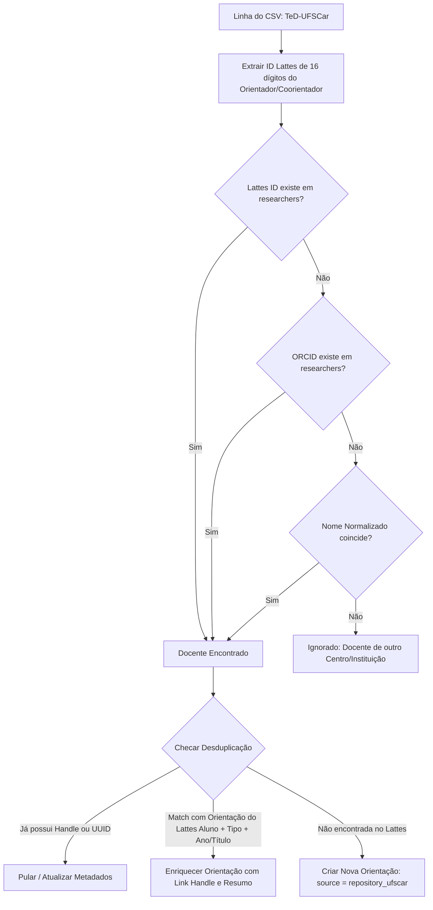

# Ingestão e Enriquecimento de Teses e Dissertações — Repositório Institucional UFSCar (TeD-UFSCar)

Este documento detalha o funcionamento, a arquitetura, o fluxo de desduplicação e os comandos do subsistema de importação e enriquecimento de **Teses e Dissertações** do **Repositório Institucional da UFSCar** ([`TeD-UFSCar.csv`](file:///Users/jonaspoli/work/html/ufscar-cech/docs/banco/TeD-UFSCar.csv)).

---

## 1. Visão Geral

O arquivo [`TeD-UFSCar.csv`](file:///Users/jonaspoli/work/html/ufscar-cech/docs/banco/TeD-UFSCar.csv) contém o catálogo completo (dump oficial) do repositório DSpace/BDTD da UFSCar, com mais de 18.000 defesas registradas em todos os programas de pós-graduação (PPGs) e centros da universidade.

### Objetivos do Subsistema:
1. **Identificar obras orientadas por docentes do CECH/UFSCar**: Mesmo que o trabalho não tenha sido cadastrado pelo docente no currículo Lattes.
2. **Enriquecer orientações existentes do Lattes**: Adicionar o link persistente do Repositório (`Handle`), resumo acadêmico, data exata de defesa, programa de pós-graduação (PPG), campus e identificadores.
3. **Cadastrar novas orientações inéditas**: Obras encontradas no repositório oficial que não estavam no Lattes do docente são inseridas como orientações concluídas válidas (`source = 'repository_ufscar'`).
4. **Idempotência e Segurança**: O processo pode ser reexecutado múltiplas vezes sem risco de duplicar orientações.
5. **Acesso Direto na Interface Web**: Disponibilizar botões de acesso direto ao repositório institucional na página de perfil do docente (`/docente/{slug}`).

---

## 2. Mapeamento dos Campos ("De / Para")

O arquivo CSV possui 32 colunas. A tabela abaixo resume como cada informação é mapeada para a entidade [`Orientation`](file:///Users/jonaspoli/work/html/ufscar-cech/src/Entity/Orientation.php) e vinculada a [`Researcher`](file:///Users/jonaspoli/work/html/ufscar-cech/src/Entity/Researcher.php):

| Coluna no CSV | Destino na Entidade `Orientation` | Regra de Negócio |
| :--- | :--- | :--- |
| `Tipo` | `orientationType` / `nature` | `Dissertação` &rarr; `TYPE_MESTRADO`<br>`Tese` &rarr; `TYPE_DOUTORADO`<br>`nature` = `CONCLUIDA` |
| `Título` | `title` | Título original em português da tese/dissertação |
| `Títulos alternativos` | `alternativeTitle` | Título em inglês ou segundo idioma |
| `Autores (Nome Sobrenome)` | `studentName` | Nome completo do discente/autor |
| `Lattes dos autores` | Chave de cruzamento | Identificação de discentes que são ou se tornaram pesquisadores da casa |
| `ORCID dos autores` | `studentOrcid` | ORCID do discente |
| `Orientadores (Nome Sobrenome)` | `researcher` | Nome do orientador (fallback de busca) |
| `Lattes dos orientadores` | `researcher` | **Chave Primária de Vínculo**: extrai os 16 dígitos e faz match com `researchers.id_lattes` |
| `ORCID dos orientadores` | `researcher` | **Chave Secundária de Vínculo**: busca por `researchers.orcid` |
| `Coorientadores (Nome Sobrenome)` | `researcher` / `isCoadvising` | Se o coorientador for docente do sistema, vincula a orientação com `isCoadvising = true` |
| `Lattes dos coorientadores` | `researcher` (Coorientador) | Extração do ID Lattes para vincular ao docente coorientador |
| `ORCID dos coorientadores` | `researcher` (Coorientador) | Chave secundária do coorientador |
| `Programas de pós-graduação` | `courseName` | Programa de Pós-Graduação (ex: *PPGE*, *PPGPol*, *PPGAdS*, etc.) |
| `Centros` | `centerName` | Centro acadêmico (ex: *CECH - Centro de Educação e Ciências Humanas*) |
| `Campus` | `campus` | Campus da UFSCar (ex: *Campus São Carlos*, *Campus Sorocaba*) |
| `Datas de publicação/defesa` | `year` / `defenseDate` | `$year` (4 dígitos) e `$defenseDate` (`DateTimeImmutable`) |
| `Resumos` | `abstractText` | Resumo acadêmico completo do trabalho |
| `Assuntos` | `keywords` | Palavras-chave separadas por ponto e vírgula |
| `DOI` | `doi` | Identificador persistente DOI |
| `URL persistente` | `handleUrl` | URL permanente do repositório (`https://repositorio.ufscar.br/handle/...`) |
| `Handle` | `handle` | Identificador Handle único (ex: `20.500.14289/24612`) |
| `UUID do item` | `repositoryUuid` | UUID permanente do registro no DSpace |

---

## 3. Resolução de Identidades e Desduplicação



### Regras de Idempotência:
1. **Verificação por Handle / UUID**: Se o registro já possui o mesmo código Handle ou UUID, não duplica e marca como `skipped` (pulado).
2. **Cruzamento com Lattes**: Se o docente já tem uma orientação com o mesmo tipo (Mestrado/Doutorado) e mesmo nome de aluno normalizado (ou título idêntico), o sistema atualiza a orientação existente adicionando `handleUrl`, `handle`, `repositoryUuid`, `abstractText`, `courseName`, `defenseDate`, etc., sem criar um novo registro.
3. **Novas Orientações**: Quando não há correspondência com o Lattes, cria-se uma nova `Orientation` com `nature = 'CONCLUIDA'`, garantindo que a produção oficial do repositório seja computada nas métricas do docente e do centro.

---

## 4. Comandos CLI do Sistema

### 4.1. Importação Completa
Executa a leitura da base oficial e atualiza o banco de dados:
```bash
php bin/console app:import:repository
# ou usando o alias:
php bin/console app:import:ted
```

### 4.2. Modo Simulação (`--dry-run`)
Analisa todo o arquivo e gera o relatório completo de correspondências sem persistir nada no banco:
```bash
php bin/console app:import:repository --dry-run
```

### 4.3. Opções Avançadas
```bash
# Limitar número de registros para testes rápidos
php bin/console app:import:repository --limit=1000

# Filtrar por Centro acadêmico específico
php bin/console app:import:repository --center=CECH

# Especificar caminho customizado do arquivo CSV
php bin/console app:import:repository --file=/caminho/outro_arquivo.csv
```

---

## 5. Como Testar e Validar

### 5.1. Testes Automatizados (PHPUnit)
Para executar o teste de integração dedicado do serviço de importação:
```bash
APP_ENV=test ./vendor/bin/phpunit tests/Service/Import/RepositoryImportServiceTest.php --testdox
```

Para rodar toda a suíte de testes do sistema:
```bash
APP_ENV=test ./vendor/bin/phpunit --testdox
```

### 5.2. Validação Visual no Navegador
1. Inicie o servidor local:
   ```bash
   symfony serve --no-tls
   # ou: php -S localhost:8000 -t public
   ```
2. Acesse a página de qualquer docente com pós-graduação, por exemplo:
   - `/docente/geraldo-luciano-andrello`
   - `/docente/ana-claudia-niedhardt-capella`
   - `/docente/jacqueline-sinhoretto`
3. Navegue até a aba **Orientações**:
   - Cada tese/dissertação enriquecida exibirá o botão verde **"Repositório UFSCar"**.
   - Clicar no botão abrirá diretamente a página oficial do trabalho com o arquivo PDF para download no Repositório da UFSCar.
   - Orientações em que o docente participou como coorientador exibirão a tag **"Coorientação"**.
